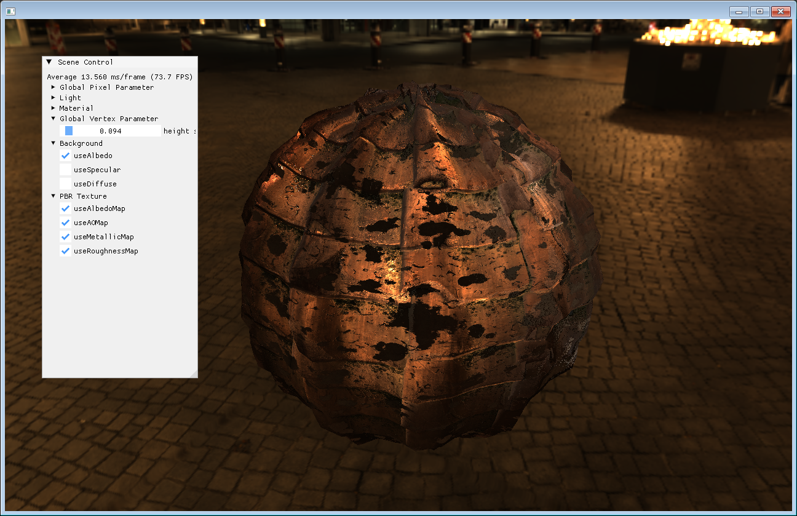

# Graphics Research Tools
## 0. 목록
### 1. Lighting

| 순번 | 조명 효과 |  비고 | 
| :---: |:---:|:---:| 
| 1.1. | Blinn-Phong |  | 
| 1.2. | PBR |  | 
| 1.3. | Fresnel Effect |  | 
| 1.4. | Rim Effect |  | 

### 2. 응용

| 순번 | 유틸리티 기능 효과 |  비고 | 
|:------------:|:----:|:----:| 
| 2.1. | Gizmo | Triangle, Sphere Intersection Algorithm | 
| 2.2. | Octomap | Geometry Shader 활용한 Octomap 랜더링 | 

### 3. 개념 정리

1. Graphics
    1. Texture 종류
    2. MASS
    3. ㅇㅇㅇ
2. 수학
    - 좌표계 상호 변환 기법(구, 카르테시안)
3. 물리

<br/>
<br/>

## 1. Light
- 빛이 매질에 충돌 시 1) 정반사가 발생하거나 물질 내부로 흡수된다. 
- 흡수되는 경우, 일부는 분자 단위의 충돌이 발생해 2) 난반사가 일어나거나 3) 감쇠한다.


### 1.1. Blinn-Phong

### 1.2. PBR(Physical-Based Rendering)
- 빛의 현상을 실제 물리법칙에 근거하여 근사 한 것이 BRDF Light(PBR)이다.



#### 1.2.1. BRDF
#### ⬜ Diffuse BRDF(Lambertian BRDF, 난반사)
>- $l$ : Surface to Light vector
>- $v$ : Surface to Eye(Camera) vector
>- $c_diff$ : Diffuse Albedo(Cubemap의 diffuseHDR Texture 활용)
>- $\pi$로 나눠 정규화(에너지 보존법칙)

$$ f(l, v)  = \frac{c_diff}{\pi} $$

#### ⬜ Micropacet Specular BRDF(Cook-Torrance BRDF, 정반사)

>- $n$ : Normal vector
>- $l$ : Surface to Light vector
>- $v$ : Surface to Eye(Camera) vector
>- $h$ : Half way vector ( ${h = normalize(l + v)}$ )
>- $k$ : 표면 거칠기
>- $\alpha$ : ${표면 거칠기^2}$
>- $F_0$ : 매질의 정반사율
>- $F(l,h)$ : Fresnel-Schlick approximation
>- $G(l,v,h)$ : Smith's Schlick-GGX Equation
>- $D(h)$ : GGX/Trowbridge-Reitz Equation
>- $G_1(vector)$ : Schlick Equation

$$ 
\begin{aligned}
&f(l, v)  = \frac{F(l,h)G(l,v,h)D(h)}{4(m \cdot l)(n \cdot v )} \\ \\ 
&F(l,h) = F_0 + (1 - F_0) \cdot 2^{(-5.55473(v \cdot h) - 6.98316)(v \cdot h)} \\ \\
&G(l,v,h) = G_1(l)G_1(v)  \\ \\
&D(h) = \frac{\alpha ^2}{\pi ((n \cdot h)^2(\alpha^2 - 1) + 1)} \\ \\
&G_1(vector) = \frac{n \cdot vector}{(n \cdot vector)(1-k) + k} \\ \\
\end{aligned}
$$

#### ⬜ 최종 합신
```hlsl
float3 diffuseBRDF = ...;
float3 specularBRDF = ...;
float3 color (diffuseBRDF + specularBRDF);
```

### 1.3. Fresnel Effect

### 1.4. Rim Effect

<br/>
<br/>

## 2. Utilities
### 2.1. Ray-Casting
#### 2.1.1. Triangle Intersection

#### 2.1.2. Shpere Intersection

<br/>
<br/>

## 3. 개념 정리
### 3.1. 그래픽스
#### 3.1.1. Texture 종류

| 용어 | 설명 | 비고 | 
|---|---|---|
| Albedo(Color, Diffuse) | RGB 컬러 이미지 | 3D | 
| AO(Ambient Occlusion) | 영역 별 광원에 얼마나 노출되는지 판단 |  | 
| Displacement(height) | 영역 별 높낮이(z축) 정보 | 1D | 
| Normal | Normal vector 정보 | 3D | 
| Roughness | 빛의 분산 정도에 대한 정보 | 3D | 
| Opacity | 텍스쳐의 투명도 정보 | 1D | 
| BRDF | LUT, $x=Normal \cdot toEye$, $y=roughness$ | 2D | 

